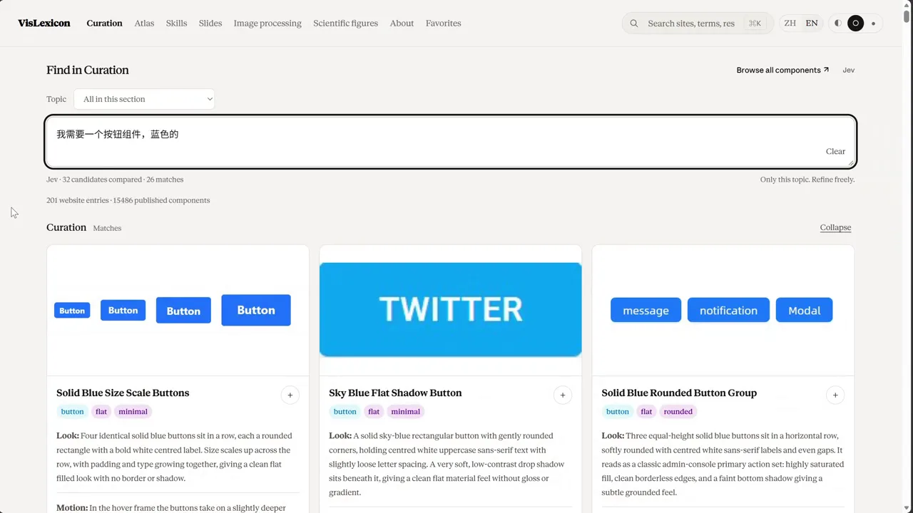
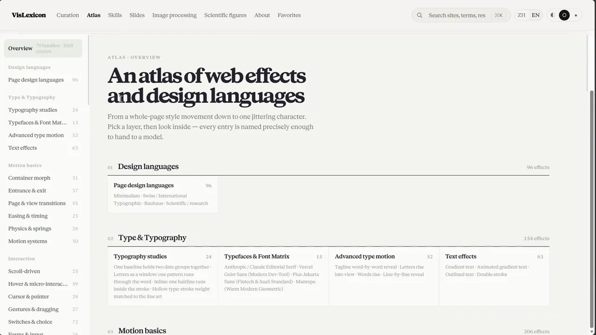
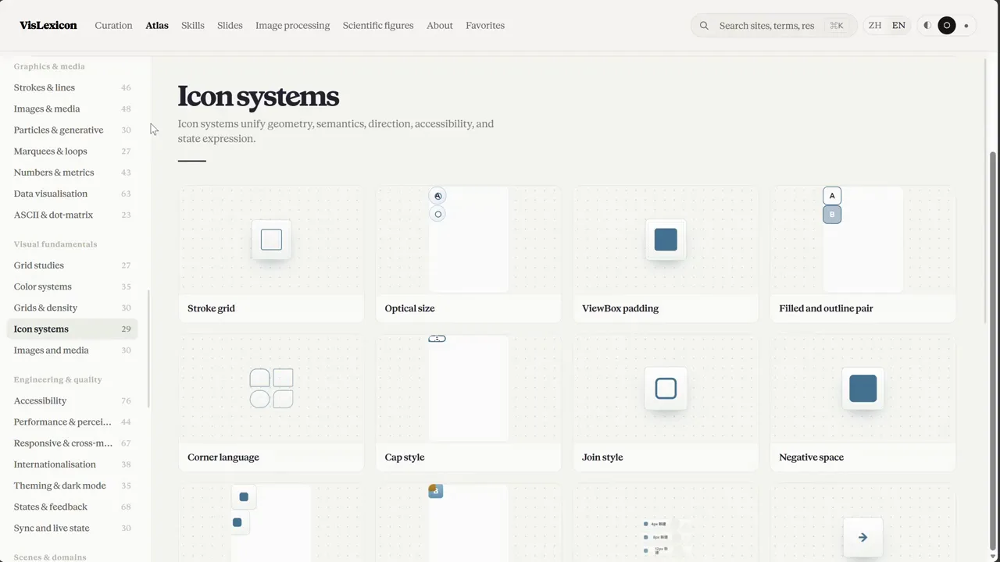
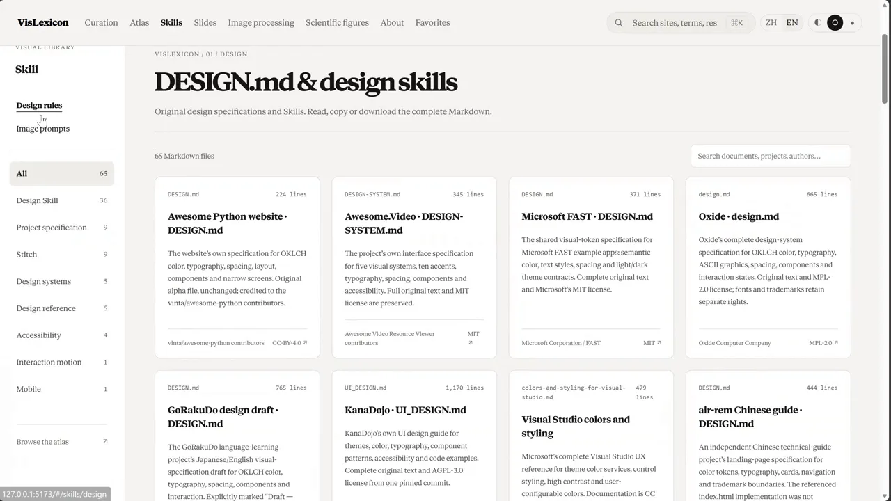
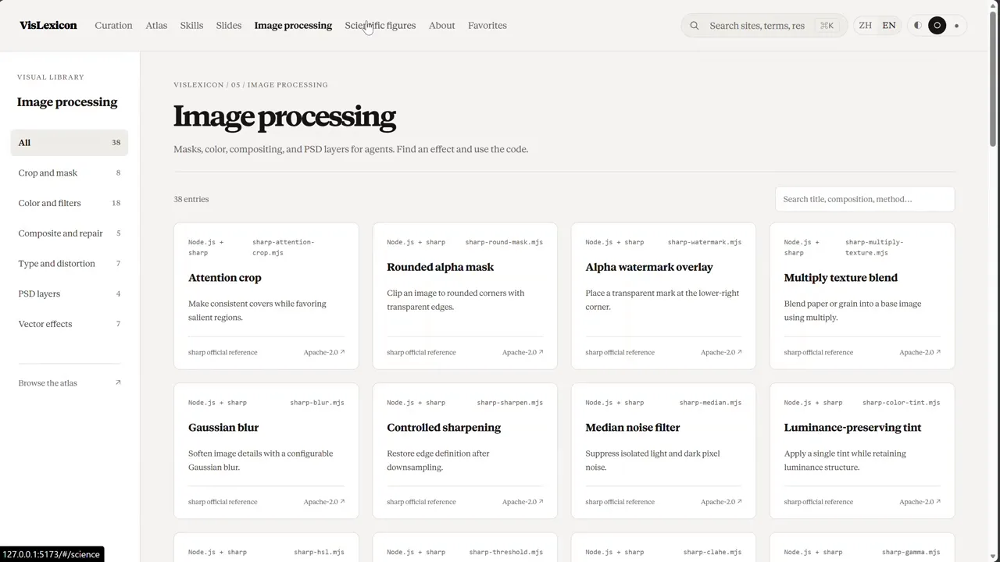
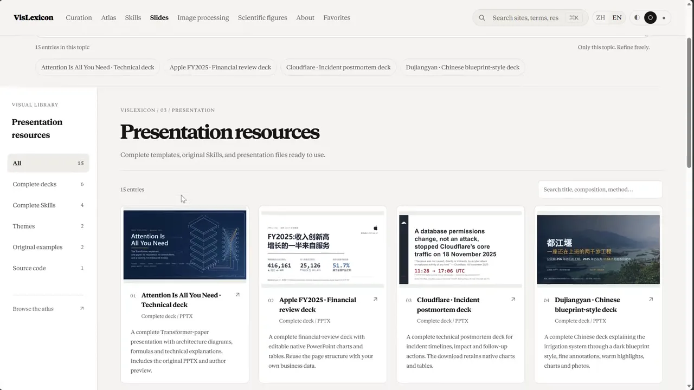
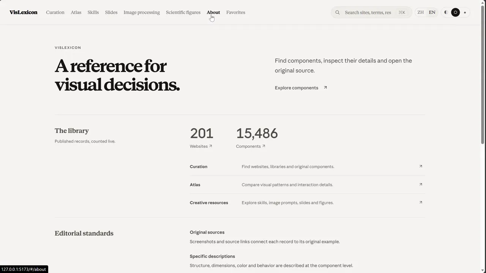

<h1 align="center">VisLexicon 视元：面向人机协作的视觉语言知识库</h1>

> 📌 **本仓库是公开演示壳子。** 包含完整界面与少量可运行示例；完整收录、采集记录、原始证据与私有素材不在仓库中，边界由构建期预算检查强制执行。

<p align="center">
  
</p>

<p align="center">
  <a href="#什么是视元">项目简介</a> ·
  <a href="#产品导览">产品导览</a> ·
  <a href="#演示">演示</a> ·
  <a href="#快速开始">快速开始</a> ·
  <a href="#核验标准">核验标准</a>
</p>

<p align="center">
  
  
  
  
  
</p>

---

## 什么是视元

VisLexicon 视元是**一套面向人机协作的视觉语言知识库**。设计资源并不稀缺，难的是需要时找得到，也能把"我喜欢这个效果"说清楚。视元把站点策展、交互式视觉图鉴、方法文档与生图提示词放进同一套检索入口，让灵感有出处、效果可预览、方法可复用。

它对人和 AI 同样友好：人可以浏览、比对、取用；模型可以通过稳定结构化的条目检索同一批视觉语言。每个条目都保留来源 URL、许可证证据与核验时间戳，尽量缩短从"我喜欢这个"到"我能实现它"的距离。

---

## 产品导览

<table>
<tr>
<td width="50%" valign="top">
<a href="assets/tour/01-curation-search.webp"></a><br/>
<sub><b>策展检索</b> — 直接用中文口语描述需求（"我需要一个按钮组件，蓝色的"），不必知道专业术语。界面同时给出候选数量、匹配数量与每条结果的判断依据。</sub>
</td>
<td width="50%" valign="top">
<a href="assets/tour/02-atlas-overview.webp"></a><br/>
<sub><b>图鉴总览</b> — 把网页效果与设计语言拆成可检索的族与条目，从整页风格运动到单个字符的抖动，逐层展开。</sub>
</td>
</tr>
<tr>
<td width="50%" valign="top">
<a href="assets/tour/03-atlas-category.webp"></a><br/>
<sub><b>图鉴分类</b> — 每个分类下的条目都配可视化预览与一句准确到可以直接交给模型的描述。</sub>
</td>
<td width="50%" valign="top">
<a href="assets/tour/04-skills-design-md.webp"></a><br/>
<sub><b>Skill 与设计规范</b> — 完整原始 <code>DESIGN.md</code> 与 <code>SKILL.md</code> 可阅读、复制、下载，并标注出处、行数与许可证。</sub>
</td>
</tr>
<tr>
<td width="50%" valign="top">
<a href="assets/tour/05-image-processing.webp"></a><br/>
<sub><b>图像处理</b> — 蒙版、色彩、合成与图层做法，每条给出可直接复用的代码与参考实现。</sub>
</td>
<td width="50%" valign="top">
<a href="assets/tour/06-presentation-resources.webp"></a><br/>
<sub><b>演示与科研绘图</b> — 成品预览、可操作示例与源文件齐备，包含完整 PPTX、原始 Skill 与图表做法。</sub>
</td>
</tr>
</table>

---

## 演示

<p align="center">
  
</p>

<sub>界面实录，约 37 秒（为便于阅读做了 1.45 倍速与分辨率压缩）。</sub>

---

## 为什么是视元

> **视觉资料不是不够，而是不可检索、无法核验、说不清楚。** 收藏夹能存链接，存不下"这个效果为什么好看"；通用图库能搜关键词，搜不到"滚动时标题逐字落下、每行错开"这种描述。

视元针对的正是这三件事：

- 🔍 **口语即查询。** 不需要知道术语叫什么，用日常中文描述你想要的观感即可。检索由 Jev 提供；未配置或暂不可用时会明确提示，不会用本地关键词匹配冒充结果。
- 📎 **每条都有出处。** 条目保留来源 URL、许可证证据与核验时间戳；身份、来源与广度证据不完整的条目进入待复核队列，不对外呈现。
- 🧩 **看得见，也拿得到。** 图鉴条目配可运行的预览；技能、规范与图像处理方法提供原文、代码与源文件，复制即可用。
- 🗣️ **描述精确到能交给模型。** 每条效果的命名与描述都按"可以直接转述给 AI"的标准撰写，天然适配 AI 检索与生成流程。
- 🌐 **中英双语，机器可读。** 界面中英切换；条目与检索索引以静态结构发布，模型可直接读取。
- 🔒 **公开与私有分离。** 公开仓库只含界面外壳与示例，完整语料留在私有侧，边界由构建脚本强制，不靠自觉。

### 与常见做法的差别

| | 浏览器收藏夹 | 通用设计图库 | **视元** |
|---|---|---|---|
| 按效果而非关键词检索 | ❌ | 部分 | **✅ 中文口语直接描述** |
| 效果可视化预览 | ❌ | 图片为主 | **✅ 可运行预览** |
| 来源与许可证证据 | ❌ | 少见 | **✅ 逐条记录并可追溯** |
| 未通过核验的条目不发布 | — | — | **✅ 严格执行** |
| 可直接复用的代码与源文件 | ❌ | 少见 | **✅ 原文 / 代码 / 源文件** |
| 面向 AI 的结构化条目 | ❌ | ❌ | **✅ 稳定结构，可直接检索** |

---

## 知识板块

| 板块 | 内容 | 呈现方式 |
| --- | --- | --- |
| **策展** | 按场景、交付物、技术栈等维度收录的网站、工具与设计系统 | 每条保留来源 URL、许可证证据与核验时间戳；组件可独立浏览、筛选，并反向关联回原网站 |
| **图鉴** | 动效、排版、布局、材质、图标、数据可视化等可检索效果 | 按族与分类组织，逐条可视化预览 |
| **Skill 与设计规范** | 完整原始 `DESIGN.md` 与 `SKILL.md` | 可阅读、复制、下载，标注出处、行数与许可证 |
| **生图方法** | 提示词与作者效果图 | 附出处与作者信息，单条支持多图查看 |
| **演示与科研绘图** | 图片裁切、蒙版、代码演示、统计图等具体做法 | 成品预览 + 可操作示例 + 源文件 |

库内规模在产品内实时统计：已核验收录 **201** 个网站，**15,486** 个组件，图鉴覆盖 **79** 个族。

---

## 快速开始

### 🧑💻 本地运行

环境要求：Node.js 22.12 及以上。

```bash
npm ci
npm run dev
```

构建与预览：

```bash
npm run build
npm run preview
```

### 🔎 启用自然语言检索

检索由 Jev 提供，运行前配置：

```bash
OPENCODE_API_KEY=<your-key>
```

未配置或 Jev 暂不可用时，已发布内容仍可正常浏览，界面会明确提示检索不可用。

### ✅ 质量命令

| 命令 | 作用 |
| --- | --- |
| `npm test` | 公开数据核对与行为测试 |
| `npm run check` | 核对示例素材、完整文档与原文摘要引用 |
| `npm run lint` | `oxlint` 静态检查 |
| `npm run build` | 构建；构建前会执行公开数据预算检查 |

---

## 公开仓库的边界

本仓库是**界面外壳与可运行示例**，不是完整数据库。完整收录、采集记录、原始证据与私有素材不在仓库中，具体边界由构建脚本强制执行：

- 生图提示词示例不超过 12 条；
- 站点示例不超过 6 条；
- 每个检索范围示例不超过 12 条；
- 提示词配图不超过 24 张；
- 私有采集路径一经出现即构建失败。

这是有意的设计：公开仓库用于展示产品形态与交互方式，完整语料保留在私有侧。

---

## 核验标准

<p align="center">
  
</p>

策展条目不是简单收录，而是逐条核验后发布：

- 每条记录来源 URL、许可证证据与核验时间戳；
- 身份、来源与广度证据不完整的条目进入待复核队列，不对外呈现；
- 发布范围与统计口径由带版本号的数据文件记录，可追溯、可复算。

---

## 技术实现

| 层次 | 技术选型 |
| --- | --- |
| 前端 | React 19 + Vite 8，原生 ES Module，无额外状态管理依赖 |
| 界面 | 中英双语切换、明暗主题、键盘可达 |
| 数据 | 条目与检索索引以静态 JSON 发布，机器可直接读取 |
| 检索 | 自然语言检索（Jev）、关键词与别名匹配、明确的降级行为 |
| 质量门禁 | `oxlint` 静态检查、`node:test` 行为测试、构建前公开数据预算检查 |

---

## 当前状态

早期阶段。当前公开仓库提供的是可运行的界面外壳与少量示例，条目仍在持续补全，整理方式、接口与数据结构在正式版本前仍可能调整。

---

## 参与与联系

问题、建议与合作意向请通过本仓库的 Issue 提出。

---

## 第三方内容与权利说明

仓库中的截图、字体、示例提示词与作者效果图，权利归各自作者所有，来源见对应条目。示例仅用于说明收录方式与呈现形式。仓库暂未附开源许可证；如需引用、转载或商业合作，请先通过 Issue 联系。
