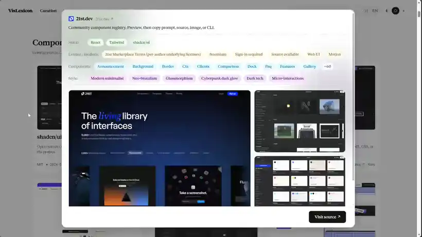

<p align="center">
  
</p>

<h1 align="center">VisLexicon · 视元</h1>

<p align="center"><strong>面向人机协作的视觉语言知识库</strong></p>

<p align="center">让看见的灵感，变成说得清、找得到、用得上的视觉语言。</p>

---

## 界面演示

<p align="center">
  
</p>

> 界面实录（约 37 秒，为便于阅读做了 1.45 倍速与分辨率压缩）。演示内容：策展检索、图鉴分类浏览、生图方法与 Skill 文档。

---

## 一、项目定位

设计资源本身并不稀缺。真正的困难在于两点：需要的时候能不能找到，以及能不能把"我喜欢这个效果"说清楚。

VisLexicon 把**站点策展**、**交互式视觉图鉴**与**可复用的方法文档**放在同一套检索入口之下，让每一份灵感都有出处、效果可预览、方法可复用。它同时面向两类使用者——人和 AI：人可以直接浏览、比对和取用；AI 可以通过稳定结构化的条目理解并检索同一批视觉语言。

项目的长期目标，是成为人与 AI 共享的视觉词典，缩短从"我喜欢这个"到"我能实现它"之间的距离。

## 二、核心板块

| 板块 | 内容 | 呈现方式 |
| --- | --- | --- |
| **策展** | 按场景、交付物、技术栈等维度收录的网站、工具与设计系统 | 每条保留来源 URL、许可证证据与核验时间戳 |
| **图鉴** | 动效、排版、布局、材质、图标、数据可视化等可检索效果 | 按 9 个 live stage 分类，逐条可视化预览 |
| **Skill 与提示词** | 完整原始设计规范与 `SKILL.md` | 可直接阅读、复制、下载 |
| **生图方法** | 提示词与作者效果图 | 附出处与作者信息，单条支持多图查看 |
| **PPT 与科研绘图** | 图片裁切、蒙版、代码演示、统计图等具体做法 | 成品预览 + 可操作示例 + 源文件 |

各板块共用同一检索入口，也可以用中文口语直接描述想要的效果。策展条目下的组件可独立浏览与筛选，并支持反向关联回原网站。

## 三、检索

- **自然语言检索**：用日常中文描述效果即可，不必知道专业术语。
- **关键词与别名**：覆盖中英文常见叫法与同义表述。
- **降级行为明确**：检索由 Jev 提供。未配置 `OPENCODE_API_KEY`，或 Jev 暂时不可用时，已发布内容仍可正常浏览，界面会明确提示检索不可用，不会用本地关键词匹配冒充结果。

## 四、技术实现

- **前端**：React 19 + Vite 8，原生 ES Module，无额外状态管理依赖。
- **界面**：中英双语切换、明暗主题、键盘可达。
- **数据**：条目与检索索引以静态 JSON 发布，机器可直接读取。
- **质量门禁**：`oxlint` 静态检查、`node:test` 行为测试，以及构建前的公开数据预算检查。

## 五、本地运行

环境要求：Node.js 22.12 及以上。

```sh
npm ci
npm run dev
```

构建与预览：

```sh
npm run build
npm run preview
```

其他命令：

| 命令 | 作用 |
| --- | --- |
| `npm test` | 运行公开数据核对与行为测试 |
| `npm run check` | 核对示例素材、完整文档与原文摘要引用 |
| `npm run lint` | 静态检查 |

`npm run build` 会先执行公开数据预算检查，超出示例上限的数据无法通过构建。

## 六、公开仓库的边界

本仓库是**界面外壳与可运行示例**，不是完整数据库。完整收录、采集记录、原始证据与私有素材不在仓库中，具体边界由构建脚本强制执行：

- 生图提示词示例不超过 12 条；
- 站点示例不超过 6 条；
- 每个检索范围示例不超过 12 条；
- 提示词配图不超过 24 张；
- 私有采集路径一经出现即构建失败。

这是有意的设计：公开仓库用于展示产品形态与交互方式，完整语料保留在私有侧。

## 七、核验标准

策展条目不是简单收录，而是逐条核验后发布：

- 每条记录来源 URL、许可证证据与核验时间戳；
- 身份、来源与广度证据不完整的条目进入待复核队列，不对外呈现；
- 发布范围与统计口径由带版本号的数据文件记录，可追溯、可复算。

## 八、当前状态

早期阶段，条目仍在持续补全，整理方式也会调整。当前公开仓库提供的是可运行的界面外壳与少量示例；接口与数据结构在正式版本前仍可能变动。

## 九、第三方内容与权利说明

仓库中的截图、字体、示例提示词与作者效果图，权利归各自作者所有，来源见对应条目。示例仅用于说明收录方式与呈现形式。如需引用、合作或授权，请通过仓库 Issue 联系。

---

## English Summary

**VisLexicon** is a knowledge base for visual language, built for both people and AI agents.

It brings together curated design resources, an interactive atlas of visual effects, reusable method documents, and image-generation prompts under a single search entry point. Every curated entry keeps its source URL, licence evidence, and a verification timestamp.

This repository contains the **interface shell and a small set of runnable examples only** — the full collection, capture records, and private assets are not included, and the boundaries are enforced by a build-time budget check.

```sh
npm ci && npm run dev   # Node.js 22.12+
```

Natural-language search is provided by Jev (`OPENCODE_API_KEY`). Without it, published content remains browsable and the interface states clearly that search is unavailable.
