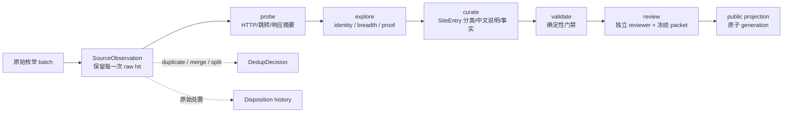

# SiteEntry 图工作流

这套流程把“发现很多网站”和“发布一张可以相信的卡”分成两个不同的结果。发现阶段可以高速并发，发布阶段必须逐条通过同一套证据门。前台布局不参与这条流水线；公开数据只来自最后的 projection。

## 固定 DAG



每个节点都是当前 `entry.revision` 的阶段结果。阶段只能在依赖成功后 claim；worker 必须带 lease token、attempt 和 revision settle。过期结果会写入 `lateSettlements`，不会推进当前阶段。

## 数据和证据

- `SourceObservation` 是不可删除的原始事实。相同 URL 出现两次仍是两条 observation；批次重跑只在 snapshot hash 完全相同时幂等，改过的批次直接冲突。
- `probe` 保存请求 URL、完整跳转、最终 URL、HTTP 状态、受限 body hash、失败原因和 retryable 判断。原始 URL 与 canonical URL 分开，fragment 不被偷偷抹掉。
- HTTP 被阻塞或请求待重试不会解锁 `explore`；探索未完成、错误页或挑战页截图不会解锁 `curate`，失败的响应与截图仍留在审计中。
- `explore` 必须来自真实页面。三张图分别是 `identity`、`breadth`、`proof`，每张截图先写入内容寻址 blob，再登记 `sha256 + bytes + mediaType + sourceUrl + method`。没有实际 blob 或 hash 不匹配，settle 会失败。
- `curate` 只接受 `recordLevel: "entry"`。AI、技术栈、平台、场景等是 facets，不会把 SourceEntity 错当成 SiteEntry。
- `validate` 是确定性检查：三类证据齐全且 hash 不同、中文说明存在、分类已确认、事实有直接 URL 和 evidence ID。它只输出 `passed`/`issues`，不会凭人工自报数量放行。
- `review` 绑定当前 `contentDigest + evidenceDigest + policyDigest`。reviewer 必须和 curator 不同，至少三项具体检查，并保存 report blob；任何事实、定位、证据或策略变化都会令旧复核过期。
- `review` 与公开导出都会重查分类、受控标签、中文说明、直接分类理由及三页证据，调用方提交 `validate.passed=true` 不能绕过这些门禁。

完整内部证据可通过 `explain` 查看；它包含 observation、处置历史、blob 引用、阶段事件和复核。公开 projection 使用白名单字段，不包含 lease token、本地路径、`evidenceId`、`graphRef` 或 packet digest。

## 存储和崩溃恢复

`graph.sqlite` 是 source of truth，启用 WAL、`synchronous=FULL`，每次 mutation 在一个 `BEGIN IMMEDIATE` 事务中同时提交 materialized state 和 hash-linked event。`state.json` / `events.jsonl` 只是便于审计和迁移的镜像，不参与写入决策。blob 先内容寻址原子写，事务失败时最多留下可清理孤儿，不会产生悬空证据引用。

运行环境要求 Node 24（使用内置 `node:sqlite`，不增加第三方数据库依赖）。启动时会校验 run ID、事件序号、前置 hash、事件 hash、blob hash、raw 计数、stage 依赖和当前 review；`verify` 失败时不能导出可发布行。

## 高速运行方式

先把目录、搜索结果、人工提交等所有来源转为 JSON/JSONL，每一行都是一个 raw hit：

```powershell
npm run site:graph -- ingest --file seeds.jsonl --batch seeds-20261004 --source-id directory-a
npm run site:graph -- run --stage probe --concurrency 8 --limit 200
npm run site:graph -- run --stage explore --concurrency 4 --limit 50
npm run site:graph -- run --stage validate --limit 200
npm run site:graph -- status
npm run site:graph -- verify
```

`probe` 可按 origin 限流并发，`explore` 复用浏览器 contexts；两者都可安全中断后续跑。`curate` 和 `review` 是需要编辑判断的边界，使用 `claim` 得到 entry packet 后再 settle；不要把未探索、未复核的候选直接写入 public data。

准备好的独立 outbox 可用 `claim --stage curate --entry site-...`，或 `--entry-ids site-a,site-b` 精确申请任务。选择入口不会跳过阶段依赖、当前租约或同源并发限制，也不会消耗未选入口的 attempt。

复核文件先从 `packet` 命令取得 digest，再提交：

```powershell
npm run site:graph -- packet --entry site-...
npm run site:graph -- review --file reviewer.json --report reviewer-report.json
npm run site:graph -- export --dir .tmp/site-entry-generation
```

导出的 `projection.json` 只包含通过门禁的 rows；`manifest.json` 记录 run、revision、graph digest 和行数。发布器应先校验 manifest 与文件 hash，再以 generation 目录加原子指针切换公开版本；中断不会替换上一版。

## 必须保持的审计不变量

1. `rawTotal = observations`，`rawSettled` 等于当前非 pending 处置数；没有静默丢弃 duplicate。
2. 一个 token 只能完成一个当前 attempt；旧 token 的 late/unknown settlement 只进审计。
3. 所有 evidence 都能在受控 blob 根目录找到，实际字节 hash 和登记 hash 相同。
4. merge 只能由强身份信号和可追溯决定支撑；未解决 identity conflict、superseded loser 不进 projection。
   未解决的同源入口拆分是可保存、可续跑的候选状态，不是数据库损坏；只有错误批准这类入口才违反不变量。
5. stage 结果必须有当前 revision 的依赖和 result digest；`approved` 不能替代 probe/explore/curate/validate。
6. projection 的公开 schema 与内部 graph schema 分离；证据透明通过 `explain`/审计包实现，不泄露本地路径和运行令牌。
